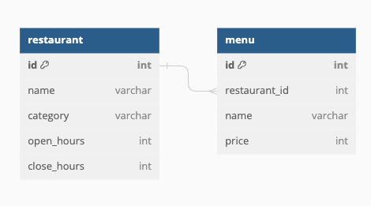
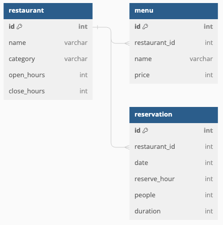

# 레스토랑서비스 CRUD
'Restful' 을 이용하여 만들자

## 초기 디자인

- 레스토랑 CRUD, 메뉴판 CRUD 구현
- 이용시간: Open < Close 을 구현

## 예약 추가

- 날짜
- 예약시간
- - restaurant.open_hours <= reserve_hour
- - restaurant.close_hours > reserve_hour
- 인원수
- - reserve_hour + duration <= restaurant.close_hours
- 몇 시간 머무는지

## 도전과제
- 예약 가능 여부를 판단할 때, 해당 데이트에 'reserve_hour + duration' 에 해당한 시간은 다시 예약에 겹침 불가

### 만드는 순서
1. Entity
2. Dto
3. Repository
4. Service
5. Controller